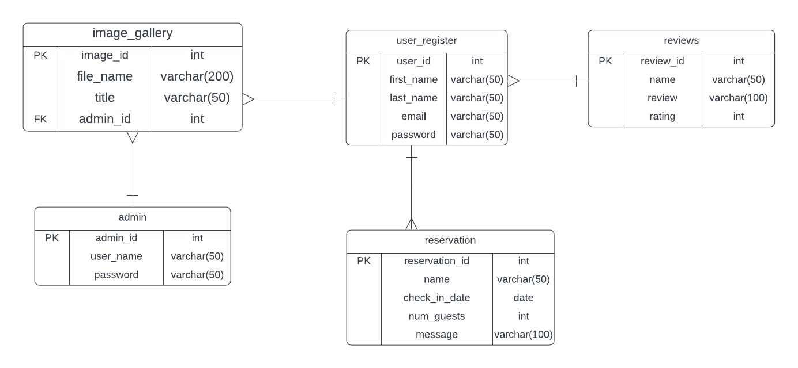

# Exercise 5: Readme.md

***Welcome to the task README!***

- You are required to create ´Readme.md´ in your project directory to document your activities throughout the project's lifecycle. 
- You will regularly update it to monitor the ongoing development of the project. 

- You will start by outlining the planned features, task assignments to team members and document the evolving progress of your work. 

- Below, you will find an example to help you get started. Feel free to customize it to match your specific requirements and needs.

# Villa Website Project - Team 11

Our project is about a small villa in costal area Hikkaduwa,SriLanka.

## Table of Contents
- [Features](#features)
- [Database Tables](#database-tables)
- [Created Forms](#created-forms)
- [Created Tables](#created-tables)

---

## Features

In this section, list and describe the features or functionality that you are working on. You can use checkboxes to track the progress of each feature.

- [ ] Feature 1 (Yayomi Premathilaka): Login/Logout/signup to the website.
- [ ] Feature 2 (Soorya Rasandi): Package selection and make reservations.
- [ ] Feature 3 (Ruwani Rangika): Add Delete images to the image gallery with admin.
- [ ] Feature 4 (Ravindu Dhananjaya): Customer review and ratings.

### Feature 1
Create login/logout/sign up page for external users.After that allow to do reservations.
The records will be saved in the database.

Link (github- code files) -
- [ ] login - https://github.com/yayomithakshila/team11php-project/blob/main/login.php
- [ ] logout - https://github.com/yayomithakshila/team11php-project/blob/main/logout.php
- [ ] sign in - https://github.com/yayomithakshila/team11php-project/blob/main/register.php

Link (shell.hamk.fi) -

### Feature 2
After successfull login by the external user direct to package page and select the prefered package.Then fill out the reservation form and complete the reservation.The records will be saved in the database.

Link (github- code files) -
- [ ] Reservation - https://github.com/yayomithakshila/team11php-project/blob/main/booking.php

Link (shell.hamk.fi) -

### Feature 3

Create a admin login to the website.Then admin can add and delete images from the website.

Link (github- code files) -
- [ ] admin.php - https://github.com/yayomithakshila/team11php-project/blob/main/admin.php
- [ ] admin_login.php - https://github.com/yayomithakshila/team11php-project/blob/main/admin_login.php
- [ ] image_remove.php - https://github.com/yayomithakshila/team11php-project/blob/main/image_remove.php
Link (shell.hamk.fi) -

### Feature 4

Users can make a ratings for the villa.This details will be recorded in a data base.
Link (github- code files) -
- [ ] Reviews - https://github.com/yayomithakshila/team11php-project/blob/main/reviews.php

## Database Tables

List the database tables that are part of your project. 

- Table 1 : Yayomi Premathilaka Table Name : user_register 
- Table 2 : Ravindu Dhananjaya Table Name : reviews
- Table 3 : Soorya rasandi  Table Name : reservation
- Table 4 : Ruwani Rangika  Table Name : admin
- Table 5 : Ruwani Rangika  Table Name : image_gallery

>  ER Diagram of the database. 

---

## Created Forms

List and describe any forms that have been created as part of your project. Include details about the purpose of each form and any validation logic.

- Form 1: (Yayomi Premathilaka):  User Sign in form      Link to the related code file (github) - https://github.com/yayomithakshila/team11php-project/blob/main/register.php    Link to the form (shell.hamk.fi).     Validations Applied and purpose - Sign in form is created for a new user to register and become a user. The user can enter first name,last name,email and then enter password.If all the details are correct user registration is successfull. In the php code The script checks if the form is submitted (isset($_POST['submit'])).
It retrieves the form data ($first_name, $last_name, $email, $password) and hashes the password using password_hash() for security.JavaScript functions are defined to validate the first name, last name, email, and password fields in real-time.The validateFName(), validateLName(), validateEmail(), and validatePassword() functions check the length and format of the input fields and display error messages if the inputs don't meet the criteria.

- Form 2: (Yayomi Premathilaka):   User login form      Link to the related code file (github)  - https://github.com/yayomithakshila/team11php-project/blob/main/login.php       Link to the form (shell.hamk.fi).   Validations Applied and purpose - Login form is created for user to login to the website by entering email and password which is already submitted to the database.Database validate the entered user data and allow the user to do the reservation. In this PHP code, there are two main types of validation applied: server-side validation and client-side validation.For the server side validation the form submittion is used ($_SERVER["REQUEST_METHOD"] == "POST").For the client side two JavaScript functions, validateEmail() and validatePassword(), are defined to validate the email and password fields, respectively. 

- Form 3: (Yayomi Premathilaka): User Log out form    Link to the related code file (github) - https://github.com/yayomithakshila/team11php-project/blob/main/logout.php    Link to the form (shell.hamk.fi).     Validations Applied and purpose - Logout form is to user to logout from the system. The php code is about session management and redirecting the user.

- Form 4: (Soorya Rasandi): Reservation Form   Link to the related code file (github) - https://github.com/yayomithakshila/team11php-project/blob/main/booking.php   Link to the form (shell.hamk.fi).    Validations Applied and purpose - This form is for the user to confirm the booking after logging in to the system.User input name,email.check in date and message is saved in the database. This code is used javascript for the validation like Name Validation (validateName()):,Number of Guests Validation (validateNumGuests()):,Message Validation (validateMessage()):.

- Form 5: (Ruwani Rangika): Admin login    Link to the related code file (github) - https://github.com/yayomithakshila/team11php-project/blob/main/admin_login.php   Link to the form (shell.hamk.fi).     Validations Applied and purpose - The admin login is to perform the backend operations.The HTML form includes the required attribute for the "Username" and "Password" input fields to ensures that the user must enter data into these fields before submitting the form. The PHP script starts by checking if the form has been submitted (isset($_POST['submit'])), which is a form of server-side validation to ensure that the script is only executed upon form submission.

- Form 6: (Ravindu Dhananjaya): reviews form   Link (github) - https://github.com/yayomithakshila/team11php-project/blob/main/reviews.php | -   Link to the form (shell.hamk.fi).  | -   Validations Applied and purpose - Reviews form is created for our customers to submit a review message regarding their experiace and also to rate us. The validateName() function checks if the name input is between 5 and 30 characters long, displaying an error message if it's not. Similarly, the validateContent() function verifies that the review content is between 15 and 100 characters in length.

---

## Created Tables

List any tables that you have created in the project work

- Table 1 (Created By): Table Name | Link to the related code file (github) | Link to the table (shell.hamk.fi).\

- Table 2 (Ravindu Dhananjaya): review table | Link  (github)- https://github.com/yayomithakshila/team11php-project/blob/main/reviews.php | Link to the table (shell.hamk.fi).

---

> Feel free to customize this README template to suit your project's specific needs. Providing clear and organized documentation will help your team members understand the project's progress and tasks effectively. This document will have a significant impact on the grading. 

